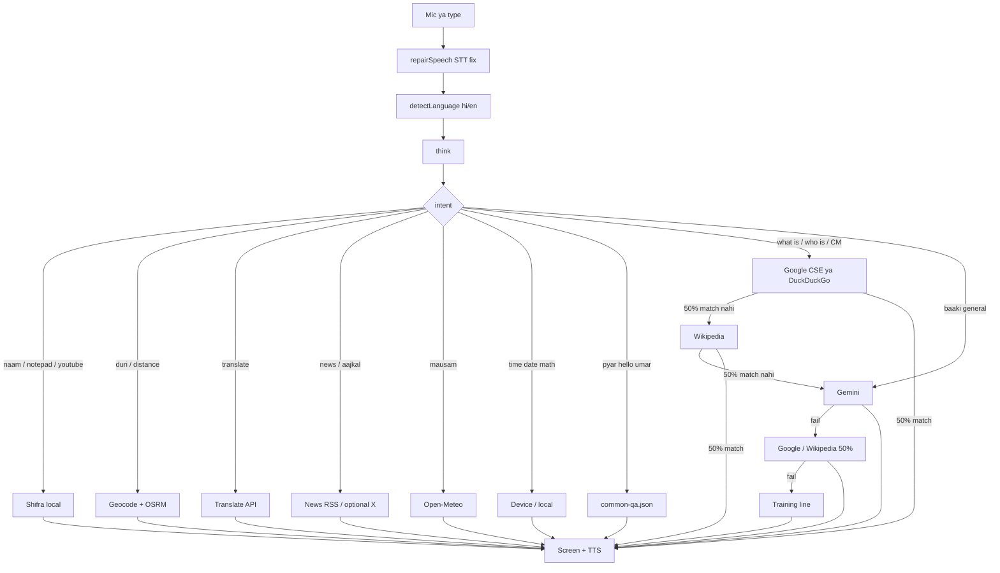

# Shifra internal process

Yeh document batata hai ki typed/boli hui line **andar** kahan se jawab banati hai. Code ki entry: `shipra/src/context/UserContext.jsx` → `think()` in `shipra/src/brain.js`.

Voice **sirf jawab** bolti hai. Source naam bubble ke neeche alag dikhta hai (`reply.text` + `reply.source`).

---

## 1. Input

1. **Hold to talk** — Web Speech API (`hi-IN` / `en-IN`). Release pe final text.
2. **Type + Send** — wahi `generateResponse`.
3. `repairSpeech` (`src/tools/speech.ts`) Hindi-STT ko English words mein sudharata hai, jaise `व्हाट इस ए लरावेल` → `what is laravel`.
4. `fold` (`src/tools/fold.ts`) Devanagari ko latin tokens mein badalta hai: `दूरी` → `duri`, `गुरुग्राम` → `gurgaon`.
5. `detectLanguage` — TTS/Gemini ki bhasha.

---

## 2. `think()` order (pehla match jeetta hai)

| Step | File / API | Source label |
|---|---|---|
| User name | `brain.js` + localStorage | Shifra |
| PC / site commands | `tools/system.ts` + `/api/system` | Shifra |
| Distance | `tools/places.ts` + OSRM | OSRM · OpenStreetMap |
| Translate | `/api/translate` ya MyMemory | Google Translate |
| Units, currency, dictionary, jokes, world time | `tools/free-tools.ts` | Currency API / Dictionary / JokeAPI / … |
| News | `/api/news` RSS | NDTV · BBC · … |
| Time / date | browser clock | Device clock |
| Weather | Open-Meteo | Open-Meteo |
| Math | local | Shifra |
| Static Q&A | `src/data/common-qa.json` | Shifra |
| Learned Q&A | localStorage | Saved answers |
| Fact lookup (`what is` / `who is` / CM) | `/api/web-search` then Wikipedia | Google / DuckDuckGo / Wikipedia — **50% word match** |
| Gemini | `src/gemini.ts` | Gemini — facts pe search fail ke baad; baaki general pehle |
| Unknown | training line + missing list | Shifra |

Distance aur translate **Gemini/Wikipedia pe nahi** girte. Parser match kare to hamesha unki API.

---

## 3. Distance andar se

1. `parseDistance` — `se` / `to` / `टू` / `तो` / `ki duri` / `distance`.
2. `geocode` — pehle known Indian cities + fuzzy naam, phir Open-Meteo, phir Nominatim (`/api/geocode`), phir Photon.
3. **OSRM** driving km + haversine air km.
4. Jagah na mile to: *Do shehar ke naam clearly bolo* — training nahi.

---

## 4. News andar se

Sirf tab jab sawal news-jaisa ho (`news`, `aajkal`, `kya chal raha`, `headline`, `twitter`).

Vite plugin `vite.web-plugin.ts` → `GET /shifra/api/news?topic=india|world|us|bihar|cricket|twitter`

- RSS: NDTV, Indian Express, The Hindu, BBC, Al Jazeera, Google News.
- Twitter: `X_BEARER_TOKEN` ho to X recent search; warna channels + screen pe note.

**Static host** (sirf HTML/JS, koi Node nahi) pe ye RSS proxy nahi chalti. Poori news ke liye `npm run preview` ya Node wala host.

---

## 5. Facts (CM, Laravel, …)

1. Tool keywords (`duri`, `samay`, `mausam`, `news`) pe Gemini/Google/Wikipedia **nahi**.
2. Knowledge sawal (`what is`, `who is`, `ke baare`, CM) pe static “hello/pyar” skip.
3. **Google** (CSE key ho to) ya DuckDuckGo — snippet tabhi jab query ke **kam se kam 50%** content words title/text mein hon.
4. Google miss → **Wikipedia** — wahi 50% rule. Violent page tabhi jab user crime poochhe.
5. Dono miss → **Gemini**. Naam/date invent mat kar; unsure ho to “nahi pata”.
6. `ka naam` pe office-definition skip karke **current holder** wali line.

---

## 6. Data files

| File | Role |
|---|---|
| `src/data/common-qa.json` | Offline bank |
| `src/data/missing-questions.json` | Training pe gire sawal (`npm run dev` pe file write) |
| `src/reply.ts` | `{ text, source }` |
| `src/config.ts` | `VITE_*` flags, Gemini model |
| `vite.web-plugin.ts` | translate, geocode, news, web-search |
| `vite.missing-plugin.ts` | missing + Fill with Gemini |
| `vite.system-plugin.ts` | notepad/docker — **sirf localhost** |

Gemini key `VITE_GEMINI_API_KEY` **build ke time** JS bundle mein chali jaati hai. `.env.local` git mein mat daalo.

---

## 7. Live vs local

| Feature | `npm run dev` / EXE | Static `live/` upload |
|---|---|---|
| Time, math, Q&A, Gemini, Wikipedia, OSRM, weather | Haan | Haan |
| News RSS, translate proxy, Nominatim proxy | Haan | Nahi, jab tak Node preview na ho |
| Notepad / Docker / drives | Haan (localhost) | Nahi |

Deploy steps: [03-live-server.md](./03-live-server.md)
